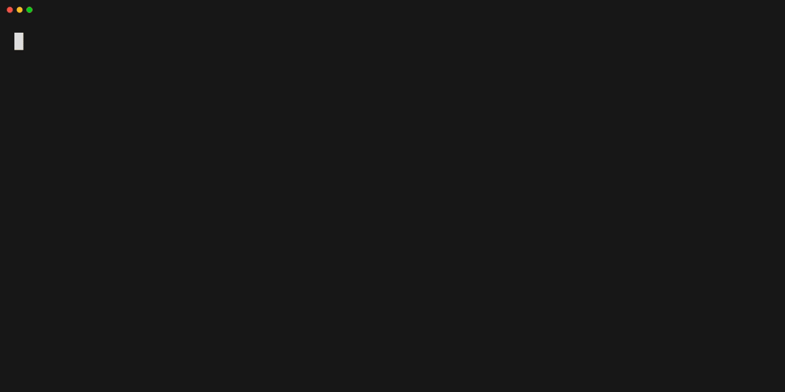

# 🐹 g0.nvim
A lightweight Golang neovim plugin that focuses on simplicity and efficiency

## 🗳️ Requirements
Neovim >= 0.9.0

## 🚀 Installation

### Lazy.nvim
```lua
  { 'shoukoo/g0.nvim',
    config = function ()
      require("g0").setup()
    end
  }
```

You can also modify the defaults config
```lua
  { 'shoukoo/g0.nvim',
    config = function ()
      require("g0").setup({
        gomodifytags = {
          tags = "xml,json"
        }
      })
    end
  }
```

## 🗄️ Configuration

g0 comes with the following defaults

```lua
{
  gotest = {
    -- run go test in verbose mode
    verbose = false
  },
  gomodifytags = {
    -- https://github.com/fatih/gomodifytags#transformations
    -- Transform adds a transform rule when adding tags.
    -- Current options: [snakecase, camelcase, lispcase, pascalcase, titlecase, keep]
    transform = "snakecase",
    -- Add/Remove tags for the comma separated list of keys. i.e.: json,xml
    tags = "json"
  },
  -- timeout in seconds, mainly used by goimports
  timeout = 1000
  debug = false,
}
```
## 🎬 Commands

### :G0Imports

Copy below to run goimports on save
```lua
local format_sync_grp = vim.api.nvim_create_augroup("G0Import", {})
vim.api.nvim_create_autocmd("BufWritePre", {
  pattern = "*.go",
  callback = function()
    local success, result = pcall(function()
      require('g0.format').goimports()
    end)

    if not success then
      vim.notify(result, vim.log.levels.ERROR)
    end
  end,
  group = format_sync_grp,
})
```

### :G0Install {pkg}
These are the available packages that can be installed using the command. To add a new package, you can add it in the lua/g0/install.lua, or manually install it

| Pkg          | Repository URL                            |
|--------------- | ----------------------------------------- |
| goimports     | golang.org/x/tools/cmd/goimports         |
| gomodifytags  | github.com/fatih/gomodifytags             |
| gopls         | golang.org/x/tools/gopls                 |

To install the goimports pkg

```vim
:G0Install goimports
```

To install the gopls pkg

```vim
:G0Install gopls 
```
### :G0InstallAll
Install all the available packages

### :G0UpdateAll
Update all the available packages

### :G0TestCurrent {args}

Running :G0TestCurrent executes the `cd {file dir} && go test -run <func name>` command in the directory of the current file. You can also provide additional valid flags as needed, which are documented in go help test.

Run the go test with the verbose flag

```vim
:G0TestCurrent -v
```

Run the go test with the integration tag

```vim
:G0TestCurrent --tag=integration
```

### :G0TestCurrentDir {args}
Running :G0TestCurrentDir executes the `cd {file dir} && go test ./...` command in the directory of the current file. You can also provide additional valid flags as needed, which are documented in go help test.

Run the go test with the verbose flag

```vim
:G0TestCurrentDir -v
```

Run the go test with the integration tag

```vim
:G0TestCurrentDir --tag=integration
```

### :[range]G0AddTags {args}

Running plain `:G0AddTags` executes the `gomodifyfiles -file={file dir} -add-tags=json` command to the current file. You can also provide additional valid flags as needed, which are documented in the [gomodifytags](https://github.com/fatih/gomodifytags) repo. Please note that it utilises default values from gomodifytags; for instance, it defaults to using `snake_case` for the tags
 

To add tags to the entire struct, position your cursor at the beginning of the struct and run the cmd below. To add a tag to a specific field, move your cursor to that field run the same cmd.
```vim
:G0AddTags
```

Highlight the fields in visual mode, and then execute the following command to add tags to them.

```vim
:'<,'>G0AddTags
```

To add both xml and json tags, run the cmd below

```vim
:G0AddTags -add-tags=xml,json
```
To use camelCase for the tags, run the cmd below

```vim
:G0AddTags -transform=camelcase
```

### :[range]G0RemoveTags {args}
Plain `G0RemoveTags` executes the `gomodifytags -file={file} -remove-tags=json` command to the current file. You can also override the flags as needed, you can find additional flags from the [gomodifytags](https://github.com/fatih/gomodifytags) repo 

To remove json tags to the entire struct, position your cursor at the beginning of the struct and run the cmd below.
```vim
:G0RemoveTags
```

Highlight the fields in visual mode, and then execute the following command to remove json tags to them.

```vim
:'<,'>G0RemoveTags
```

To remove both xml and json tags, run the cmd below

```vim
:G0RemoveTags -remove-tags=xml,json
```
### :[range]G0ClearTags {args}
Plain `G0ClearTags` executes the `gomodifytags -file={file} -clear-tags` command to the current file. You can also override the flags as needed, you can find additional flags from the [gomodifytags](https://github.com/fatih/gomodifytags) repo 

To clear tags to the entire struct, position your cursor at the beginning of the struct and run the cmd below.
```vim
:G0ClearTags
```

Highlight the fields in visual mode, and then execute the following command to remove json tags to them.

```vim
:'<,'>G0ClearTags
```

To remove both xml and json tags, run the cmd below

```vim
:G0ClearTags
```
